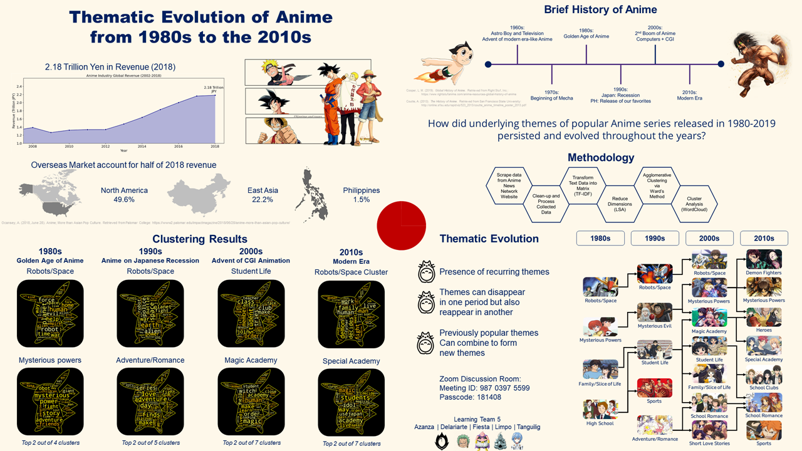

# Thematic Evolution of Anime from 1980s to the 2010s

[Joseph Matthew Azanza](https://www.linkedin.com/in/josephazanza/) | [Christian Angelo Delariarte](https://www.linkedin.com/in/jelodelariarte/) | [Lyon Alec Fiesta](https://www.linkedin.com/in/lyonfiesta/) | [Alfonso Limpo](https://www.linkedin.com/in/alfonsolimpo/) | [Rea Tanguilig](https://www.linkedin.com/in/rea-tanguilig/)  
Asian Institute of Management

## Abstract

As Filipinos, we typically know Anime as TV shows originating form Japan and we consider it as a significant part of our culture. A lot of 90's kids are Anime fans, and in recent times, more and more are becoming fans due to Anime's reach and impact. In terms of business impact, Anime had a global revenue of 2.18 trillion yen in 2018, and not only is it about TV shows, but it also includes other avenues such as merchandising, music, movies, video games etc. Given the global business and cultural impact that anime has, our team believes there is merit in understanding popular Anime, and we asked, "how did underlying themes of popular Anime series released in 1980-2019 persist and evolve throughout the years?"

To answer this question, we scraped relevant Anime data from the Anime News Network Website, then we cleaned and processed our data by removing rows with no <b>Plot</b> entries, by using rating to filter for the top 50 anime TV shows per year, and then we grouped the top anime by decade. We then tranformed the plot data per decade into their TF-IDF representation via the TFIDF Vectorizer module in sklearn. The dimensions of matrices per decade were reduced via the LSA algorithm, and the resulting matrices were clustered via Ward's algorithm. Clusters were interpreted analyzed via WordClouds.

In total we found 23 clusters for all decades. Four clusters were found for 1980s, namely: <b>Robots/Space</b>, <b>Mysterious Powers</b>, <b>Family/Slice of Life</b>, and <b>High School</b>. Five clusters were found for 1990s, namely: <b>Robots/Space</b>, <b>Adventure/Romance</b>, <b>Student Life</b>, <b>Mysterious Evil</b>, and <b>Sports</b>. Seven clusters were found for 2000s, namely: <b>Student Life</b>, <b>Magic Academy</b>, <b>School Romance</b>, <b>Mysterious Powers</b>, <b>Short Love Stories</b>, <b>Family/Slice of Life</b>, and <b>Robots/Space</b>. Lastly, seven clusters were found for 2010s, namely: <b>Demon Fighters</b>, <b>Special Academy</b>, <b>Mysterious Powers</b>, <b>Heroes</b>, <b>School Romance</b>, <b>School Clubs</b>, and <b>Sports</b>. The names of the clusters were determined from the most dominant words given by the generated word clouds. In terms of thematic evolution, we found that themes for famous anime are recurring. We also found that themes can disappear in one period but also reemerge in another period. Lastly, we found that themes popular in previous decades can combine and form new themes.

Overall, we successfully identified clusters of Anime themes per decade using the plot data from 1980 up until 2019. We also found insights on how themes behaved and evolved throughout time. In terms of value, anime creators and producers, and fans can use our findings strategize on what kinds of anime shows to explore for production and consumption, respectively. In terms of recommendations, we recommend an alternative methodology via soft clustering. We also recommend the inclusion of additional data such as financial success of top anime per decade to link profit and anime themes, as well as data on production studios, time slots for airing, and watcher demographic data (in compliance with privacy laws) to give further insights on potential customer behavior.
  
<b>Keywords:</b> unsupervised learning, clustering, thematic analysis

---

**Source code can be provided upon request, and upon approval of all project collaborators**

---

## [Back to main page](https://josephazanza.github.io/)