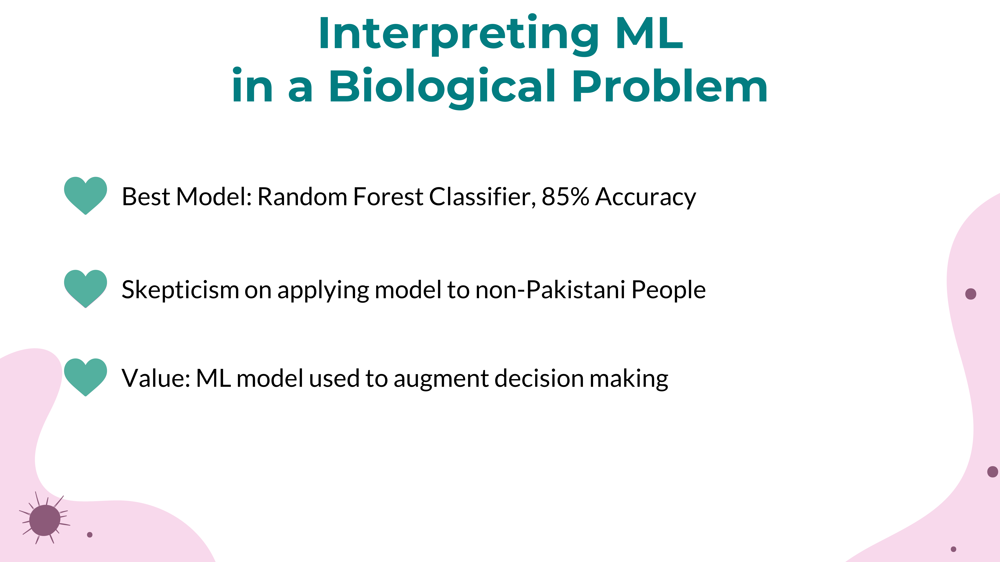

# Machine Learning in Biology: Predicting Heart Failure based on Patient Medical History and Blood Chemistry

[Joseph Azanza](https://www.linkedin.com/in/josephazanza/)  
Asian Institute of Management

## Executive Summary

<ol>
	<li> 
 We can use the Leave One Out Cross Validation method to handle datasets with small samples as the calculated test accuracies are more robust than the train-test split method 
 </li>

	<li> 
 Application and interpretation of ML in a biological problem is highly context dependent. In this study, while I was able to create an ML model with an 85% accuracy (trained on data from Pakistani patients), applying this model to predict heart failures for non-Pakistani people should be handled with skepticism. There are some context changes on a molecular level that even traditional machine learning models might not account for. 
 </li>

	<li> 
 The value that the ML model with 85% accuracy gives when we applied in a different context is that it can provide us with a base expectation of what can happen. The ML model is used to augment decision making but not replace the decision makers. 
 </li>
</ol>

---

**Source code available at [ML1_indiv](https://github.com/josephazanza/ML1_indiv)**

---

## [Back to main page](https://josephazanza.github.io/)